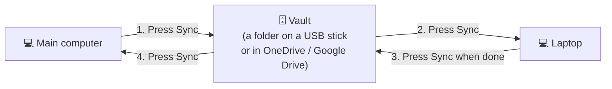

# AI Session Vault

**Take your Claude and ChatGPT work with you from one computer to another.**

You work on your main computer. One day you have to use your laptop instead. Normally your Claude Code conversations, settings and memory stay behind on the main computer. With AI Session Vault, you press one button before you leave and one button when you arrive, and everything is there on the laptop. When you come back, it works the same way in reverse.

---

## What it does, in one picture



The **vault** is just a folder. **Sync** is the button that copies your newest work into that folder, and from that folder onto the computer you're using. That's the whole idea.

---

## Words used in this guide

| Word | What it means |
|---|---|
| **Vault** | A folder that holds a copy of your AI work. It lives on a USB stick or in a cloud folder (OneDrive, Google Drive, Dropbox) so every computer can reach it. |
| **Sync** | Option `1` in the program. It saves this computer's newest work into the vault, then brings in anything newer from your other computer. |
| **Passphrase** | A long password you make up once. It locks your vault. You type the same one on every computer. |
| **Session** | One conversation with Claude Code. |

---

## What you need

- A **Windows** computer and a **Windows** laptop (Mac and Linux work too; see [Using a Mac or Linux](#using-a-mac-or-linux)).
- **One** of these, to hold the vault:
  - **Best:** OneDrive, Google Drive or Dropbox installed on both computers. The vault then moves between them by itself, even in an emergency.
  - **Or:** a USB stick that you carry with you.
- Claude Code (and/or Claude Desktop, Codex) installed on both computers, and **signed in** on both.
- About 10 minutes.

---

## Part 1: Set up on your main computer (once)

**Step 1. Download the program.**
Go to the [latest release page](https://github.com/Aryansingh0783/ai-session-vault/releases/latest). Under **Assets**, click **`ai-session-vault.exe`** to download it.

**Step 2. Make a home for your vault.**
Open File Explorer and create a new folder called **`AI Vault`**:
- inside your **OneDrive** or **Google Drive** folder (best), **or**
- on your **USB stick**.

Move `ai-session-vault.exe` from your **Downloads** folder into this new **`AI Vault`** folder.

> The program always keeps your vault next to itself, so it must live in this folder, not in Downloads.

**Step 3. Close your AI apps.**
Close Claude Code (close its terminal window), Claude Desktop and Codex, if they're open.

**Step 4. Open the program.**
Double-click **`ai-session-vault.exe`**.

If a blue box says **"Windows protected your PC"**: click **More info**, then **Run anyway**. This appears because the program is new to Windows. It only happens the first time.

A black window opens with this menu:

```
AI Session Vault
  1. Sync this device (backup, then restore newest from vault)
  2. Backup only   (this device -> vault)
  3. Restore only  (vault -> this device)
  4. Import Claude / ChatGPT export zips from data/inbox
  5. Make a context pack (continue a chat anywhere)
  6. Status
Choose:
```

**Step 5. Type `1` and press Enter.**

**Step 6. Create your passphrase.**
You'll be asked to create a passphrase. Type a long one (at least 12 characters, for example four random words), press Enter, then type it again and press Enter.

> **Nothing shows on screen while you type. That's normal.** Your typing is hidden on purpose.
>
> **Write your passphrase down somewhere safe** (a password manager is best). If you forget it, it can't be recovered.

**Step 7. Wait for it to finish.**
Some lines will scroll past. When you see **`Done. Press Enter to close.`**, press Enter.

✅ **Done.** A new folder called **`data`** has appeared next to the program. That's your vault. Don't delete it.

---

## Part 2: Set up your laptop (once)

**Step 1. Get the vault onto the laptop.**
- **OneDrive / Google Drive:** wait until the `AI Vault` folder appears on the laptop and has finished syncing (its sync icon shows it's up to date).
- **USB stick:** plug it in.

**Step 2. Close your AI apps** on the laptop (Claude Code, Claude Desktop, Codex).

**Step 3.** Open the **`AI Vault`** folder and double-click **`ai-session-vault.exe`** (the same one, not a new download).

**Step 4.** Type **`1`** and press **Enter**.

**Step 5.** Type **the same passphrase** you created on your main computer and press **Enter**.

**Step 6.** When you see **`Done. Press Enter to close.`**, press Enter.

✅ **Done.** Your laptop now has your Claude Code conversations, settings and memory from the main computer.

---

## Part 3: Everyday use

You only ever do one thing: **close your AI apps, then run Sync** (double-click the program, type `1`, Enter, type your passphrase, Enter).

### 🏠 When you finish work on your main computer
1. Close your AI apps.
2. Run **Sync**.

Make this a habit at the end of every day. Then, if you suddenly have to use the laptop, your latest work is already waiting in the vault.

### 💼 When you start work on the laptop
1. Wait for OneDrive / Google Drive to finish syncing (or plug in the USB stick).
2. Close your AI apps.
3. Run **Sync**.
4. Open Claude Code in your project and type **`/resume`** (or start it with `claude --resume`). Your conversations from the main computer are in the list. Pick one and carry on.

### 🏁 When you finish on the laptop
1. Close your AI apps.
2. Run **Sync**.
3. **OneDrive / Google Drive:** leave the laptop switched on and online for a minute so the folder finishes uploading. **USB:** take the stick with you.

### 🏠 Back at your main computer
1. Wait for OneDrive / Google Drive to finish syncing (or plug in the USB stick).
2. Close your AI apps.
3. Run **Sync**.

✅ Everything you did on the laptop is now on your main computer.

> **Writing code?** This tool moves your *AI conversations and settings*, not your project files. Keep using Git/GitHub for your code: push before you leave a computer, pull when you arrive.

---

## Something went wrong?

| What you see | What to do |
|---|---|
| **"Windows protected your PC"** | Click **More info**, then **Run anyway**. |
| **"Wrong vault passphrase."** | Type the passphrase you created in Part 1. Check Caps Lock. |
| **"…is missing from this vault…"** or **"There's no vault here yet"** | OneDrive / Google Drive hasn't finished copying the vault to this computer. Wait a few minutes and try again. Don't create a new passphrase. |
| **"…couldn't be written (open in another app? close it and run again)"** | An AI app was still open. Close Claude Code, Claude Desktop and Codex, then run Sync again. |
| **"NOT installed: … aren't signed"** | Some files in the vault weren't made by you (or were made by an older version). Run Sync on your other computer, then run it here again. |
| **The window closes straight away** | Make sure the program is inside your `AI Vault` folder (not inside a zip file or Downloads), then try again. |
| **I can't see my conversations** | Open Claude Code **in the same project folder** you used on the other computer, then use `/resume`. |
| **I forgot my passphrase** | It can't be recovered. Delete the `data` folder and start again from Part 1. Your computers keep their own copies, so nothing is lost from them. |

More problems and fixes: [full troubleshooting list](docs/GUIDE.md#troubleshooting).

---

## Is it safe?

- **Your passphrase locks the vault.** API keys (passwords for services) inside your settings are scrambled so nobody can read them.
- **Nobody can sneak anything in.** Every file in the vault is sealed with your passphrase. If someone changes a file, your computer refuses to use it.
- **Nothing is ever deleted.** Before a file on your computer is replaced, the old version is kept in a folder called `.ai-vault-backups` in your user folder (the last 10 syncs are kept).
- **Your logins are never copied.** You sign in to each app on each computer yourself.
- **Keep the vault private.** Your conversations themselves are readable by anyone who has the vault folder. So keep the USB stick safe, or use your own personal cloud account.

---

## Extras (optional)

- **Save your claude.ai and ChatGPT website chats too:** [how to import them](docs/GUIDE.md#importing-claudeai-and-chatgpt-chats) into a searchable page on your computer.
- **Back up automatically every evening:** [set up the daily backup](docs/GUIDE.md#optional-automatic-daily-backup-windows), so you never forget.
- **Continue a chat in any AI:** [context packs](docs/GUIDE.md#context-packs) turn a conversation into text you can paste into a new chat.
- **Update to a new version:** download the new `ai-session-vault.exe` and replace the old one in your `AI Vault` folder. Keep the `data` folder.

### Using a Mac or Linux

Mac and Linux use the Python version instead of the EXE, with the same vault folder. See [Install](docs/GUIDE.md#install) and [Quick start](docs/GUIDE.md#quick-start) in the full guide.

---

## Want the details?

- [Full guide](docs/GUIDE.md): how it works inside (with diagrams), everything that gets copied, the command line, and all options.
- [Command reference](docs/USAGE.md)
- [Security details](docs/SECURITY.md)

## License

[MIT](LICENSE)
