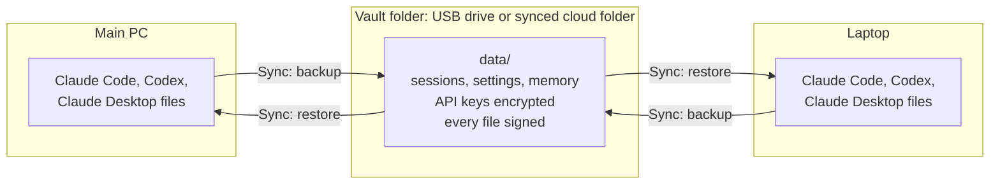
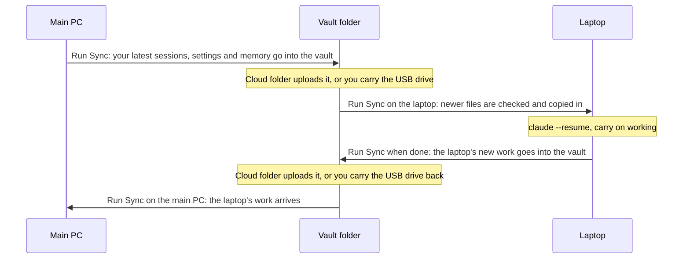
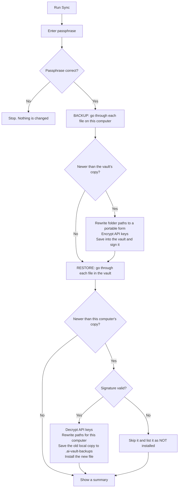

# AI Session Vault: full guide

The complete reference. New to this? Start with the simple guide in the [README](../README.md).

Carry your AI work between computers. Put this folder on a USB drive or in a synced folder (Google Drive, OneDrive, Dropbox, iCloud), run it on each device, and pick up where you left off.

- **Claude Code**: session history (`claude --resume` works on the other machine), CLAUDE.md, rules, settings, custom commands/agents/skills, auto-memory, MCP servers
- **Codex CLI**: sessions, config, prompts, AGENTS.md
- **Claude Desktop**: config and MCP servers
- **claude.ai and ChatGPT**: import your data exports into one searchable offline archive
- **Context packs**: turn any chat or session into a paste-ready prompt to continue it anywhere

One Python file, standard library only, no install step. Works on Windows, macOS and Linux. On Windows you can also use the standalone **`ai-session-vault.exe`**, which needs no Python at all.

API keys are encrypted and every file is signed with your passphrase, so a vault on a shared or cloud drive can't be used to plant anything on your devices. See [Security](#security).

---

## Contents

- [How it works](#how-it-works)
- [Requirements](#requirements)
- [Install](#install)
- [Quick start](#quick-start)
- [Windows: using the EXE](#windows-using-the-exe)
- [Walkthrough: main PC and laptop](#walkthrough-main-pc-and-laptop)
- [Everyday use](#everyday-use)
- [What gets synced](#what-gets-synced)
- [Importing claude.ai and ChatGPT chats](#importing-claudeai-and-chatgpt-chats)
- [Context packs](#context-packs)
- [Command line](#command-line)
- [When project folders live in different places](#when-project-folders-live-in-different-places)
- [Security](#security)
- [Troubleshooting](#troubleshooting)
- [Uninstall / reset](#uninstall--reset)
- [Limitations](#limitations)

More detail: [docs/USAGE.md](USAGE.md) (every command and option, and [building the EXE](USAGE.md#building-the-windows-exe)) and [docs/SECURITY.md](SECURITY.md) (how encryption and signing work).

---

## How it works

### The big picture

Each computer keeps its own Claude Code / Codex / Claude Desktop files where those apps expect them. The vault is a folder (on a USB drive or in a synced cloud folder) that sits between your computers. **Sync** copies the newest version of each file into the vault, and from the vault onto the computer you're using.



### A round trip, step by step



1. **Main PC → vault.** Sync backs up everything that changed since the last time.
2. **The vault travels.** A synced folder uploads it by itself; with a USB drive, you carry it.
3. **Vault → laptop.** Sync on the laptop copies in whatever is newer than what the laptop has.
4. **Work on the laptop.** `claude --resume` lists the sessions from your main PC.
5. **Laptop → vault.** Sync again when you're done.
6. **Vault → main PC.** Sync on the main PC brings the laptop's work back.

Your code isn't part of this: move it with git (`git push` / `git pull`). The full checklist is in [Walkthrough: main PC and laptop](#walkthrough-main-pc-and-laptop).

### What happens inside one Sync



**Backup** (this computer → vault), for every file that is newer here than in the vault:

1. Folder paths inside session logs are made portable: `C:\Users\Aryan\code\app` becomes `~/code/app`.
2. API keys and tokens in config files are encrypted with your passphrase.
3. The file is written into `data/` and signed, so any later change by someone else is detected.

**Restore** (vault → this computer), for every file that is newer in the vault than here:

1. The signature is checked. A file that isn't signed with your passphrase is never installed.
2. API keys are decrypted, and paths are rewritten for this computer (`~/code/app` becomes `/Users/aryan/code/app` on a Mac).
3. The file it replaces is saved to `~/.ai-vault-backups/` first, then the new file is installed.
4. New MCP servers are added and printed on screen, so you can see what will run.

**Rules that always hold:**

- **Newest wins.** Files are compared by when they were last changed. The newer copy is kept; nothing is merged.
- **Nothing is deleted** from your computers or from the vault.
- **Your passphrase never leaves your head.** It isn't saved anywhere unless you set it up for the [automatic backup](#optional-automatic-daily-backup-windows).
- **Logins are never copied.** You sign in to each app on each computer.

## Requirements

**Using the Windows EXE?** Nothing to install: it includes Python and the encryption package. Skip to [Install](#install).

- **Python 3.8 or newer.** Tested on 3.10–3.13.
  - Windows: install from [python.org](https://www.python.org/downloads/) (tick "Add python.exe to PATH").
  - macOS: `python3` comes with the Xcode command line tools, or install from python.org / Homebrew.
  - Linux: already installed on most distributions.
- **Recommended:** the `cryptography` package, so API keys in your configs can be carried between devices:
  ```
  pip install cryptography
  ```
  Without it everything else still works; API keys just stay on the device they're on (they are never written to the vault unencrypted).

## Install

**Windows, no Python needed:** use `ai-session-vault.exe`. Step-by-step: [Windows: using the EXE](#windows-using-the-exe).

**Any OS, with Python:** download this repository into the place you want the vault to live:

- **USB drive or synced folder:** click **Code → Download ZIP**, unzip it there, or
- **git:**
  ```
  git clone https://github.com/Aryansingh0783/ai-session-vault.git
  ```

Everything the tool stores goes into a `data/` folder next to `vault.py`. It is ignored by git, so your chats can't be committed by accident.

## Quick start

**1. On your first device**, run the launcher:

| OS | How to run |
|---|---|
| Windows | Double-click `ai-session-vault.exe` ([details](#windows-using-the-exe)), or `Run-Windows.bat` if you use the Python version |
| macOS | Double-click `Run-Mac.command` (first time: right-click → Open) |
| Linux | `./run-linux.sh` |

Or from a terminal in the folder: `python3 vault.py` (Windows: `py vault.py`; in **Git Bash** use `winpty py vault.py` so the passphrase prompt works).

**2. Choose `1. Sync`.** You'll be asked to create a vault passphrase (12+ characters). Use the same passphrase on every device. It can't be recovered, so store it in your password manager.

**3. Move to your next device** (plug in the USB drive or wait for the cloud folder to sync), close Claude Code / Claude Desktop / Codex, run the launcher, choose `1. Sync`, and enter the same passphrase.

That's it. Run **Sync** whenever you switch devices: it backs up this device into the vault, then restores anything newer from your other devices.

```
AI Session Vault
  1. Sync this device (backup, then restore newest from vault)
  2. Backup only   (this device -> vault)
  3. Restore only  (vault -> this device)
  4. Import Claude / ChatGPT export zips from data/inbox
  5. Make a context pack (continue a chat anywhere)
  6. Status
```

## Windows: using the EXE

`ai-session-vault.exe` is the whole tool in one file. It includes Python and the encryption package, so there's nothing to install.

### 1. Download it

1. Open the [latest release](https://github.com/Aryansingh0783/ai-session-vault/releases/latest) and, under **Assets**, download `ai-session-vault.exe`.
2. Create a folder where the vault will live and move the EXE into it. **The vault is always created next to the EXE**, so pick this folder deliberately:
   - on a USB drive, e.g. `E:\AI Vault`
   - or in a synced folder, e.g. `C:\Users\<you>\OneDrive\AI Vault` or your Google Drive folder
3. Optional, stops the "Windows protected your PC" warning: right-click the EXE → **Properties** → at the bottom, tick **Unblock** → **OK**. (Only shown for downloaded files.)

### 2. First run (your first PC)

1. Close Claude Code, Claude Desktop and Codex.
2. Double-click `ai-session-vault.exe`. If Windows shows "Windows protected your PC", click **More info → Run anyway**.
3. A black window opens with the menu. Type `1` and press **Enter** (Sync).
4. Create your vault passphrase (12+ characters) and type it again to confirm. **Nothing appears while you type; that's normal.** Save it in your password manager: it can't be recovered.
5. When it finishes, press **Enter** to close the window. A `data` folder now sits next to the EXE. That's your vault.

### 3. Your other PCs

1. Plug in the USB drive, or wait until your synced folder has finished syncing (including the `data` folder).
2. Close Claude Code, Claude Desktop and Codex.
3. Double-click the **same** `ai-session-vault.exe` in that folder, choose `1`, and enter the **same** passphrase.

From then on, run **Sync** (`1`) whenever you leave a PC and when you arrive at the next one.

Using a Mac or Linux machine too? Put `vault.py` (and `Run-Mac.command` / `run-linux.sh`) from this repo in the same folder. They use the same `data` folder as the EXE.

### Command line (optional)

Open the vault folder in File Explorer, click the address bar, type `powershell` and press Enter. Then:

```powershell
.\ai-session-vault.exe sync                # backup, then restore
.\ai-session-vault.exe sync --dry-run      # show what would change, change nothing
.\ai-session-vault.exe status
.\ai-session-vault.exe import              # everything in data\inbox
.\ai-session-vault.exe context "landing page"
.\ai-session-vault.exe restore --map "D:\work=~/work"
```

In Command Prompt, drop the `.\` (`ai-session-vault.exe sync`). In **Git Bash**, use `winpty ./ai-session-vault.exe sync`, otherwise the passphrase prompt can't work.

To skip the passphrase prompt for one PowerShell window: `$env:AI_VAULT_PASSPHRASE = "your passphrase"`.

### Importing claude.ai / ChatGPT exports

Choose `4` once. This creates `data\inbox` next to the EXE. Put your export `.zip` files there, choose `4` again, then open `data\archive\archive.html` in your browser. See [Importing claude.ai and ChatGPT chats](#importing-claudeai-and-chatgpt-chats) for how to get the exports.

### Updating to a new version

Close the EXE, download the new `ai-session-vault.exe` from the [latest release](https://github.com/Aryansingh0783/ai-session-vault/releases/latest), and replace the old file in the vault folder. Keep the `data` folder. If the folder is synced, your other PCs get the new EXE too.

### Where things are on Windows

| What | Where |
|---|---|
| Your vault | the `data` folder next to `ai-session-vault.exe` |
| Claude Code | `C:\Users\<you>\.claude\` and `C:\Users\<you>\.claude.json` |
| Codex CLI | `C:\Users\<you>\.codex\` |
| Claude Desktop config | `%APPDATA%\Claude\claude_desktop_config.json` |
| Safety copies made by restore | `C:\Users\<you>\.ai-vault-backups\` (newest 10 kept) |

## Walkthrough: main PC and laptop

The full round trip, for when your main PC is where you work and you sometimes have to switch to a laptop, planned or in an emergency. The steps are the same for any two devices. "Run Sync" means: double-click the EXE (or launcher) and choose `1`.

**Key idea:** the vault only knows what was synced into it. In an emergency you may not be able to reach your main PC, so keep the vault current *before* you need it (step 1).

### Once: set up both devices

1. **Put the vault folder in a synced folder** (OneDrive, Google Drive, Dropbox). A USB drive also works, but only if the drive is with you when the emergency happens.
2. **Main PC:** follow [Quick start](#quick-start) (or [Windows: using the EXE](#windows-using-the-exe)). Run Sync and create your passphrase.
3. **Laptop:** install the same apps you use (Claude Code, Claude Desktop, Codex) and **sign in to each one**. Login tokens are never copied, on purpose. Make sure the synced folder is on the laptop too.
4. **Code:** the vault carries your AI sessions and settings, *not* your project folders. Keep projects in git (GitHub), and clone them on the laptop at the same place under your user folder, e.g. `C:\Users\<you>\code\my-app`. A different location works too; see [different places](#when-project-folders-live-in-different-places).
5. **Recommended:** turn on the [automatic daily backup](#optional-automatic-daily-backup-windows) on the main PC, so an emergency never catches the vault out of date.

### Every day on the main PC

At the end of the day (or before you step away), close Claude Code, Claude Desktop and Codex, **run Sync**, and `git push` your code. The automatic backup covers you on days you forget.

### Switching to the laptop

1. Wait until the synced folder is up to date on the laptop (OneDrive/Google Drive icon shows it's synced), including the `data` folder.
2. `git pull` your projects.
3. Close Claude Code, Claude Desktop and Codex. **Run Sync** and enter your passphrase.
4. Open a terminal in your project and run `claude --resume`. Your sessions from the main PC are listed; pick one and carry on. Codex: `codex resume`. Your CLAUDE.md, rules, commands, memory and MCP servers are already in place.

### When you're done on the laptop

1. Close Claude Code, Claude Desktop and Codex.
2. **Run Sync.** This puts the laptop's work into the vault.
3. `git push` your code.
4. Keep the laptop online until the synced folder has finished uploading.

### Back on the main PC

1. Wait for the synced folder to finish downloading, then `git pull`.
2. Close Claude Code, Claude Desktop and Codex. **Run Sync.**
3. `claude --resume` now includes what you did on the laptop.

### Good to know

- **Don't continue the same session on both devices without syncing in between.** Each session is one file and the newest copy wins. If it happens anyway, the replaced copy is in `C:\Users\<you>\.ai-vault-backups\`.
- **Chats on claude.ai, chatgpt.com and the Claude/ChatGPT apps** already follow your account to any device. Nothing to do for them.
- **Unsure what a sync will change?** Run `ai-session-vault.exe sync --dry-run` (or `python3 vault.py sync --dry-run`) first.
- **Messages after a sync** tell you what needs attention; see [Troubleshooting](#troubleshooting).

### Optional: automatic daily backup (Windows)

This backs up the main PC into the vault every day at 7 pm, even if you forget. Open **Command Prompt** (Start → type `cmd`; not PowerShell, which handles the quotes differently) and run the following, with your own passphrase and the path to your EXE:

```bat
setx AI_VAULT_PASSPHRASE "your vault passphrase"
schtasks /Create /TN "AI Session Vault backup" /SC DAILY /ST 19:00 /TR "\"E:\AI Vault\ai-session-vault.exe\" backup"
```

Then **sign out of Windows and back in** so the scheduled task can see the passphrase. It runs only while you're signed in; a window appears briefly while it runs. It only *backs up*: restoring is always something you do yourself, with your apps closed. With the passphrase saved, the EXE also stops asking for it on this PC.

- Test it: open **Task Scheduler**, find "AI Session Vault backup", right-click → **Run**, then check `status` shows a new backup time.
- Remove it: `schtasks /Delete /TN "AI Session Vault backup" /F` and `reg delete HKCU\Environment /v AI_VAULT_PASSPHRASE /f`, then sign out and back in.
- `setx` stores the passphrase in your Windows user profile. Only do this on a PC that only you use.
- Python version: use `/TR "py \"E:\AI Vault\vault.py\" backup"` instead.

## Everyday use

- **Leaving a device:** run Sync (or Backup) so the vault has your latest work.
- **Arriving at a device:** close your AI apps, run Sync. Then `claude --resume` shows your sessions from the other machine.
- **Newest file wins.** Nothing is ever deleted, on your devices or in the vault.
- **Safety net:** before restore replaces a file on your device, the old copy is saved to `~/.ai-vault-backups/<date-time>/`. The newest 10 of these folders are kept.
- **Not sure?** Add `--dry-run` on the command line to see what would change without changing anything.

## What gets synced

| App | What | Where on your device |
|---|---|---|
| Claude Code | Session history, including subagent logs | `~/.claude/projects/` |
| | Auto-memory (`MEMORY.md` and topic files) | `~/.claude/projects/<project>/memory/` |
| | CLAUDE.md, rules, settings, commands, agents, skills, output styles | `~/.claude/` |
| | User-scope MCP servers | `mcpServers` in `~/.claude.json` (new servers are added; yours are never overwritten) |
| Codex CLI | Sessions, archived sessions, config.toml, AGENTS.md, prompts | `~/.codex/` |
| Claude Desktop | `claude_desktop_config.json` (MCP servers, preferences) | Windows `%APPDATA%\Claude\`, macOS `~/Library/Application Support/Claude/`, Linux `~/.config/Claude/` |

`CLAUDE_CONFIG_DIR` and `CODEX_HOME` are respected if you've set them.

**Never synced:** login tokens (`.credentials.json`, Codex `auth.json`) and account state in `~/.claude.json`. Sign in once on each device.

**Paths are rewritten per device.** Session logs record the folder you worked in. The vault stores paths under your home folder as `~/...` and rewrites them on restore, so a session from `C:\Users\Aryan\code\app` resumes as `/Users/aryan/code/app` on a Mac. Your project folders themselves aren't copied; use git for code.

## Importing claude.ai and ChatGPT chats

Web and app chats already sync across devices when you're signed in to the same account. Importing gives you an offline, searchable backup across both services, and lets you move context between them.

1. Request your export:
   - **Claude:** Settings → Privacy → Export data
   - **ChatGPT:** Settings → Data controls → Export data
2. When the email arrives, download the `.zip` and drop it into `data/inbox/`.
3. Run the launcher and choose `4. Import`.

You get:
- `data/archive/archive.html`: open it in any browser. Search titles and message text, filter by service, and copy any conversation as a context pack.
- `data/archive/markdown/claude/` and `.../chatgpt/`: one Markdown file per conversation.

Importing a newer export later adds new chats and updates changed ones; nothing is duplicated. Imported zips move to `data/inbox/done/`.

## Context packs

A context pack is a conversation turned into a prompt you can paste into a new chat (Claude, ChatGPT or anything else) to carry on from where you left off.

- Menu `5`, or `python3 vault.py context "search words"`
- Searches imported chat titles, Claude Code session titles and project paths, and session IDs
- Saves to `data/context-packs/` and copies to your clipboard
- Long conversations keep the first message and as many recent messages as fit (default 60,000 characters, change with `--max-chars`)

In the archive page, the **Copy as context pack** button does the same for any imported chat.

## Command line

```
python3 vault.py                      # interactive menu
python3 vault.py sync                 # backup, then restore
python3 vault.py backup               # this device -> vault
python3 vault.py restore              # vault -> this device
python3 vault.py restore --dry-run    # show what would change
python3 vault.py sync --only claude-code          # or codex, claude-desktop (comma-separated)
python3 vault.py restore --map "D:\work=~/work"   # see below
python3 vault.py import                # everything in data/inbox
python3 vault.py import ~/Downloads/export.zip
python3 vault.py context "landing page" --pick 1
python3 vault.py status
```

Set `AI_VAULT_PASSPHRASE` to skip the passphrase prompt in scripts or scheduled runs. Full reference: [docs/USAGE.md](USAGE.md).

## When project folders live in different places

If a project lives outside your home folder, or at a different place on another device, restore tells you:

```
! These project folders don't exist on this device (sessions restored anyway):
    D:\work\site
```

Point it at the right place with `--map OLD=NEW` (repeatable):

```
python3 vault.py restore --map "D:\work=~/work"
python3 vault.py restore --map "/Volumes/SSD/projects=D:\projects"
```

## Security

The vault holds sensitive data and may sit on a cloud drive, so:

- **Your API keys are encrypted** with AES-256-GCM before they reach the vault. That covers MCP server `env` and `headers`, `env` in settings.json, key/token/secret fields in Desktop and Codex configs, and values that look like keys (`sk-…`, `ghp_…`, `AKIA…`, JWTs). The key is derived from your passphrase with scrypt.
- **Every file is signed.** Backup signs each file it writes into the vault. Restore installs only files with a valid signature. Someone who can write to your vault folder but doesn't know your passphrase can't add hooks, commands or MCP servers, or plant instructions in your agent's memory or sessions. Anything rejected is listed and never installed.
- **Tampered files get replaced.** A backup from a device that has the real file overwrites a tampered copy in the vault.
- **Restore shows every MCP server it adds**, with its command, because MCP servers run programs.

**Not encrypted:** chat transcripts (Claude Code sessions and the imported archive). Keep the vault somewhere only you can read. Details and the full threat model: [docs/SECURITY.md](SECURITY.md).

## Troubleshooting

| Message / problem | What to do |
|---|---|
| Windows: "Windows protected your PC" when opening the EXE | The EXE isn't code-signed, so SmartScreen warns on first run. Click **More info → Run anyway**, or unblock it first (Properties → **Unblock**). You can check it was built from this repo's code in the **Actions** tab. |
| The EXE window opens and closes immediately | Run it from PowerShell (`.\ai-session-vault.exe status`) to see the message, and check the vault folder isn't read-only. |
| The vault went somewhere unexpected | The vault is always the `data` folder next to the EXE you ran. Move the EXE and its `data` folder together. |
| Antivirus flags or quarantines the EXE | Some antivirus tools flag PyInstaller-built EXEs by mistake. Restore it and add an exception, or use the Python version (`Run-Windows.bat`). |
| `Git Bash can't show a hidden passphrase prompt` | Run `winpty ./ai-session-vault.exe` (EXE) or `winpty py vault.py` (Python), double-click the EXE / `Run-Windows.bat`, or set `AI_VAULT_PASSPHRASE`. |
| `vault_key.json is missing from this vault…` | Your synced folder hasn't finished syncing. Wait for it; don't create a new passphrase. |
| `There's no vault here yet` | Run Sync or Backup on the device that has your sessions first, and let the folder sync. |
| `N file(s) couldn't be written (open in another app? close it and run again)` | Close Claude Code / Claude Desktop / Codex and run Sync again. Everything else was still synced. |
| `Wrong vault passphrase.` | Use the passphrase you created on the first device. It can't be reset; see [Uninstall / reset](#uninstall--reset) to start a new vault. |
| `NOT installed: N file(s) … aren't signed` | Files in the vault weren't signed with your passphrase: tampered, or from a version before signing. Run a backup on the device that has the real files. If you don't recognize a file, delete it from the vault folder. |
| `API keys can't be encrypted/decrypted on this device yet` | Python version only (the EXE includes it): `pip install cryptography`, then run Sync again. |
| `Not applied yet: N secret(s) couldn't be decrypted` | Same as above. The affected config is skipped (never installed with placeholders) and applies on the next restore. |
| Sessions don't show in `claude --resume` | Make sure the project folder exists at the path restore printed, or use `--map`. Restart Claude Code. |
| Restored changes get overwritten | Close Claude Code, Claude Desktop and Codex before restoring. |
| macOS: "can't be opened because it is from an unidentified developer" | Right-click `Run-Mac.command` → Open, or run `python3 vault.py` in Terminal. |
| Windows: `Python 3 is not installed` | Install from python.org with "Add python.exe to PATH" ticked. |
| Cloud drive made `(1)` copies of files | Two devices wrote at once. Run Sync again on each device, then delete the duplicate copies. |

## Uninstall / reset

- **Remove the tool:** delete the folder (or the EXE and its `data` folder). Nothing is installed elsewhere, apart from the safety-net copies in `~/.ai-vault-backups/` (the newest 10 runs), which you can delete any time.
- **Start a new vault** (for example, a forgotten passphrase): delete the `data/` folder and run Sync on each device. Your devices keep their own files.

## Limitations

- Chat transcripts are stored unencrypted (see [Security](#security)).
- claude.ai / ChatGPT chats come from data exports; there is no live sync with those services.
- Someone with write access to the vault could put back an *older* signed copy of one of your files. It's still your own content, but it could undo a recent change.
- Context packs are built from the vault without checking signatures. Read a pack before pasting it.
- Newest-wins works per file: if you edit the same file on two devices before syncing, the later edit wins. This includes continuing the same Claude Code session on two devices without syncing in between.
- The archive page holds every imported conversation in one HTML file. Very large exports (hundreds of MB) may be slow to open.

## License

[MIT](../LICENSE)
